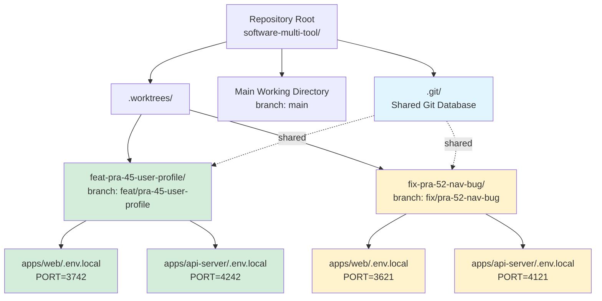

# Git Worktrees Skill

> **🚨 MANDATORY: This system requires worktrees for ALL feature work 🚨**

Enable parallel development with isolated git worktrees for concurrent features, testing, and code review.

> **🚨 CRITICAL: Only use Supabase databases 🚨**
>
> Worktrees must use **Supabase Local** (port 54322) or **Supabase Preview**.
>
> **NEVER use Homebrew PostgreSQL** (port 5432). It lacks storage, proper seeding, and will cause auth failures.
>
> The setup script automatically enforces Supabase Local. If you see port `5432` in your `.env.local`, the configuration is wrong.

## System Architecture: Why Worktrees Are Mandatory

**This repository is designed for parallel development** with multiple Claude Code instances working simultaneously.

**Core principles:**

- **Pure main branch**: Main stays clean as a reference point, never blocked by WIP
- **Complete isolation**: Multiple agents can work without interfering with each other
- **User freedom**: You can experiment on main without disrupting agent work
- **Zero coordination overhead**: Add more parallel work without conflicts

**DO NOT use `git checkout -b`** - standard branching violates this architecture. ALL feature work must use isolated worktrees.

## Quick Reference

| Operation | Command |
| --------- | ------- |
| **Create worktree (automated)** | `pnpm worktree:create <issue-key> <type> <description>` |
| **Remove worktree (automated)** | `pnpm worktree:remove <worktree-name>` |
| **List worktrees** | `pnpm worktree:list` |
| Create worktree manually | `git worktree add <path> -b <branch-name>` |
| List all worktrees | `git worktree list` |
| Remove worktree manually | `git worktree remove <path>` |
| Prune stale references | `git worktree prune` |
| Check if directory is ignored | `git check-ignore -q <directory>` |

## Automated Worktree Setup (Recommended)

> **Use the automated setup script for all worktree operations.**

The `worktree-setup.sh` script automates the complete worktree setup process, eliminating manual steps and common errors.

### Single Command Setup

```bash
# Create a fully configured worktree
pnpm worktree:create PRA-163 feat improve-auth-flow

# Or use the script directly
./tooling/scripts/src/worktree-setup.sh create PRA-163 feat improve-auth-flow
```

This single command:

1. ✅ Creates the git worktree with proper branch naming
2. ✅ Copies environment files from parent repository
3. ✅ Allocates unique ports for web app and api-server
4. ✅ Installs/links dependencies (`pnpm install`)
5. ✅ Generates Prisma client
6. ✅ Runs baseline type-check verification
7. ✅ Reports success with next steps

### Available Commands

```bash
# Create a new worktree
pnpm worktree:create <issue-key> <type> <description>
# Examples:
#   pnpm worktree:create PRA-163 feat worktree-automation
#   pnpm worktree:create 42 fix navigation-bug

# Remove a worktree (with safety checks)
pnpm worktree:remove <worktree-name>
# Example:
#   pnpm worktree:remove feat-pra-163-worktree-automation

# List all worktrees
pnpm worktree:list

# Resume/repair setup on existing worktree
pnpm worktree:resume <worktree-name>
# Example:
#   pnpm worktree:resume feat-pra-163-worktree-automation
```

### Branch Types

| Type | Use Case |
| ---- | -------- |
| `feat` | New features |
| `fix` | Bug fixes |
| `chore` | Maintenance tasks |
| `docs` | Documentation |
| `refactor` | Code refactoring |
| `test` | Test improvements |

### Fail-Fast and Idempotent

- **Fail-fast**: Script stops on first error with clear message
- **Idempotent**: Safe to re-run on existing worktrees to complete setup
- **Safety checks**: Warns about uncommitted changes before removal

### Example Workflow

```bash
# 1. Create worktree for Linear ticket
pnpm worktree:create PRA-163 feat improve-auth-flow

# 2. Navigate to worktree (script shows this path)
cd .worktrees/feat-pra-163-improve-auth-flow

# 3. Start development
pnpm dev

# 4. After PR is merged, clean up
cd ../..
pnpm worktree:remove feat-pra-163-improve-auth-flow
```

## When to Use This Skill

Use git worktrees when you need to:

- **Parallel development**: Work on multiple features simultaneously (PRA-123 and PRA-456) without context switching
- **PR review**: Check out and test pull requests locally while preserving your current work
- **Hotfix workflow**: Create urgent fixes from main while continuing feature development
- **Isolated testing**: Run integration tests in parallel across different branches
- **Code comparison**: Compare implementations side-by-side in different worktrees

**Activation keywords**: parallel development, multiple branches, review PR locally, hotfix, isolated environment, concurrent work, switch between features

## Prerequisites

- **Git 2.5+**: Worktree support (check: `git --version`)
- **Docker**: Required for Testcontainers-based integration tests
- **pnpm**: Monorepo package manager (worktrees share parent `node_modules`)
- **Disk space**: Each worktree is a full working directory (~500MB+)
- **Environment variables**: Integration tests require `apps/web/.env.local` with API credentials (see Environment Variables for Integration Tests section)

## Core Principle

> **Systematic directory selection + safety verification = reliable isolation**

This skill follows a three-tier priority system for directory selection and enforces safety checks before worktree creation to prevent common pitfalls.

### Visual Overview



**Key**: All worktrees share `.git/` but have independent working directories. Each worktree has unique ports for both web app (3501-3999) and api-server (4001-4499).

## Directory Selection Process

Follow this priority order when deciding where to create worktrees:

### 1. Check for Existing Directories

Look for existing worktree directories in the repository:

```bash
# Check for hidden directory (preferred)
[ -d ".worktrees" ] && echo "Using .worktrees/"

# Check for visible directory
[ -d "worktrees" ] && echo "Using worktrees/"
```

**Rule**: If `.worktrees/` exists, use it (takes precedence over `worktrees/`). If only `worktrees/` exists, use that.

### 2. Check CLAUDE.md

Search `CLAUDE.md` for worktree directory preferences:

```bash
grep -i "worktree" CLAUDE.md
```

If the project documents a preference, use it without asking.

### 3. Ask User

If no existing directory or documented preference, offer two options:

#### Option A: Project-local (Recommended)

- Path: `.worktrees/` (hidden directory in repository root)
- Pros: Co-located with project, easy access
- Cons: Requires `.gitignore` entry, uses project disk space
- Best for: Teams, active development

#### Option B: Global

- Path: `~/.config/software-multi-tool/worktrees/`
- Pros: Outside repository, no `.gitignore` needed
- Cons: Harder to find, manual cleanup required
- Best for: Personal workflows, disk space constraints

## Safety Verification Requirements

### For Project-Local Directories

**CRITICAL**: Always verify the worktree directory is git-ignored before creation.

```bash
# Check if directory is ignored
git check-ignore -q .worktrees

if [ $? -ne 0 ]; then
  echo "ERROR: .worktrees/ is not in .gitignore"

  # Add to .gitignore
  echo ".worktrees/" >> .gitignore

  # Commit the change
  git add .gitignore
  git commit -m "chore: add .worktrees/ to .gitignore

  Configure git-ignore for worktree directory to prevent
  accidentally committing parallel development environments.

  🤖 Generated with [Claude Code](https://claude.com/claude-code)

  Co-Authored-By: Claude Sonnet 4.5 <noreply@anthropic.com>"
fi
```

**Why this matters**: Without `.gitignore`, worktree directories appear as untracked files and can be accidentally committed.

### For Global Directories

No verification needed - directory is outside the repository entirely.

## Manual Worktree Creation

> **Prefer using the automated setup** (`pnpm worktree:create`) which handles all steps automatically.

For manual setup, see [examples.md](examples.md) for complete workflows including:

- Basic worktree creation with port allocation
- Parallel development with multiple worktrees
- Hotfix workflow
- Code review workflow
- Cleanup after PR merge

**Quick manual setup:**

```bash
# Create worktree
git worktree add .worktrees/feat-pra-35-auth -b feat/pra-35-auth
cd .worktrees/feat-pra-35-auth

# Configure environment
cp ../../apps/web/.env.local apps/web/.env.local
WORKTREE_PORT=$(../../tooling/scripts/src/worktree-port.sh .)
echo "PORT=$WORKTREE_PORT" >> apps/web/.env.local

# Start development
pnpm dev
```

## pnpm Monorepo Considerations

Worktrees **share** from parent: `node_modules/`, `.turbo/`, `.git/hooks/`, `.git/config`

Worktrees have **independent**: working directory, `.env.local`, Turbo task runs

**Clear Turbo cache** if experiencing build inconsistencies: `pnpm clean`

## Port and Database Management

The automated setup script handles port allocation and database configuration. For detailed diagrams and explanations, see [diagrams.md](diagrams.md).

**Key points:**

- **Dev server ports**: Automatically allocated from 3501-3999 (deterministic + collision-safe)
- **API server ports**: Offset by +500 (4001-4499)
- **Integration tests**: Testcontainers allocates random PostgreSQL ports automatically
- **Local development**: All worktrees share Supabase local (port 54322)

**Quick commands:**

```bash
# Allocate port for worktree
WORKTREE_PORT=$(../../tooling/scripts/src/worktree-port.sh .)

# Check port usage
lsof -i :3500-3999 | grep LISTEN

# Start/reset Supabase local
supabase start
supabase db reset
```

See [environment-setup.md](environment-setup.md) for detailed configuration.

**Note**: The `worktree-setup.sh` script automatically verifies Supabase local is running and seeds the database if needed.

## Environment Setup

See [environment-setup.md](environment-setup.md) for detailed configuration including:

- Environment variable isolation (shared vs per-worktree)
- Port allocation strategy for parallel development
- API server environment configuration
- Integration test credentials
- Database configuration (Testcontainers and Supabase local)

## Baseline Verification

Run in new worktrees to verify clean state:

```bash
pnpm test                                         # Unit tests
pnpm --filter web run type-check                  # TypeScript
pnpm --filter @repo/database run test:integration # Integration (Testcontainers)
```

**Parallel testing supported**: Testcontainers creates isolated PostgreSQL containers per worktree.

**Skip** `pnpm test:ci` during setup (coverage thresholds too strict).

## Troubleshooting

See [troubleshooting.md](troubleshooting.md) for common issues including:

- Stale worktree references
- Port conflicts
- Database URL mismatches
- Quick Login failures
- Schema migration issues
- Missing API credentials

## Cleanup Workflow

```bash
# Verify PR is merged, then:
pnpm worktree:remove feat-pra-35-auth   # Automated (recommended)

# Or manually:
git worktree remove .worktrees/feat-pra-35-auth
git branch -d feat/pra-35-auth
git worktree prune
```

See [examples.md](examples.md) for complete cleanup workflow including Linear issue closure.

## Related Skills

- **`linear` skill** (`.claude/skills/linear/`): Issue lookup, status updates, and closure workflow
- **`linear-workflow` skill**: Complete Linear-based development workflow
- **`github-cli` skill**: Create pull requests from worktree branches
- **`dev:work-on-ticket` skill**: Automated ticket workflow (worktrees enable parallel execution)
- **`dev:pull-request` skill**: Create organized PRs from worktree changes
- **`prisma-migrate` skill**: Database migrations in isolated worktrees
- **`better-auth` skill**: Authentication development in dedicated worktrees
- **`application-environments` skill**: Local Supabase setup with worktrees (see "Supabase Local Stack" section)

## Git Hooks Integration

### Shared Hooks

Worktrees inherit `.git/hooks/` from the parent repository. All hooks apply to ALL worktrees:

- **Pre-commit hooks**: Biome linting, type-checking, tests
- **Commit-msg hooks**: Message format validation
- **Custom hooks**: `.claude/hooks/prevent-main-commit.sh` (blocks main commits)

### Per-Worktree Bypass

If you need to bypass hooks in a specific worktree (use with caution):

```bash
# Bypass hooks for single commit
git commit --no-verify -m "..."

# Not recommended - defeats purpose of hooks
```

## Best Practices

1. **Use descriptive branch names**: Follow `<type>/pra-<issue>-<description>` convention
2. **Clean up regularly**: Remove worktrees after PR merge
3. **Prune stale references**: Run `git worktree prune` periodically
4. **Configure PORT per worktree**: Avoid dev server conflicts
5. **Share .env.local thoughtfully**: Copy parent template, customize only what's needed
6. **Leverage Testcontainers**: Don't manually configure DATABASE_URL for tests
7. **Monitor disk usage**: Each worktree uses ~500MB+
8. **Document worktree purpose**: Add comment in .env.local or README
9. **Follow Linear workflow**: Include PRA-XX in branch names, close issues after merge
10. **Test before cleanup**: Verify PR is merged and deployed before removing worktree
