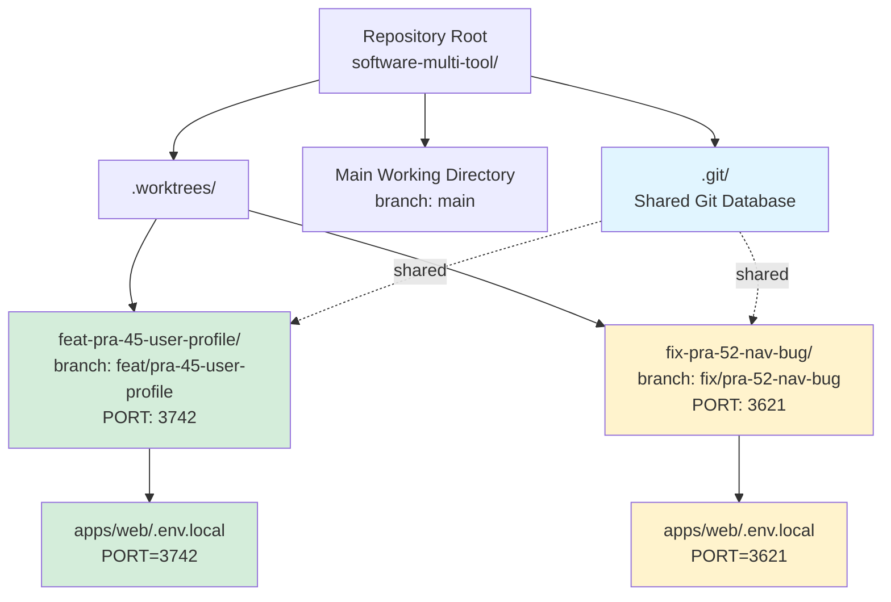
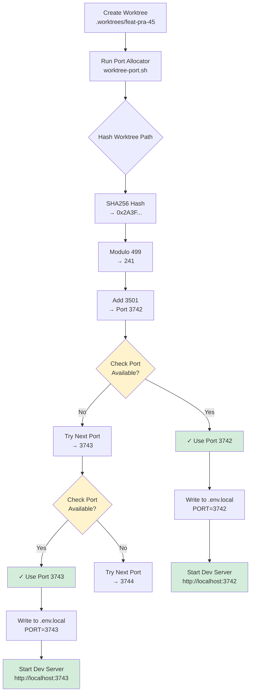
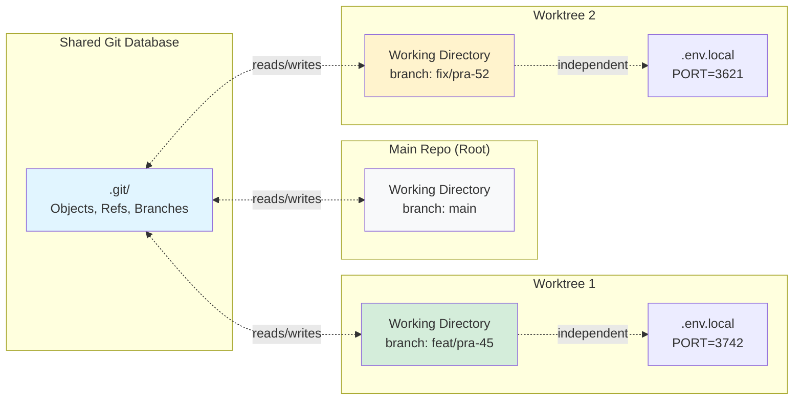
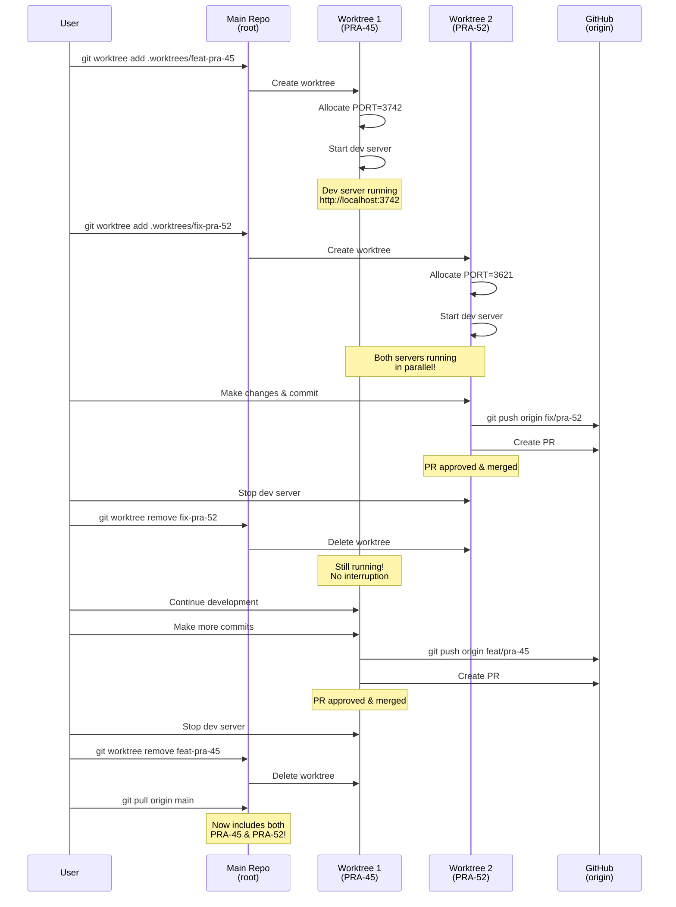
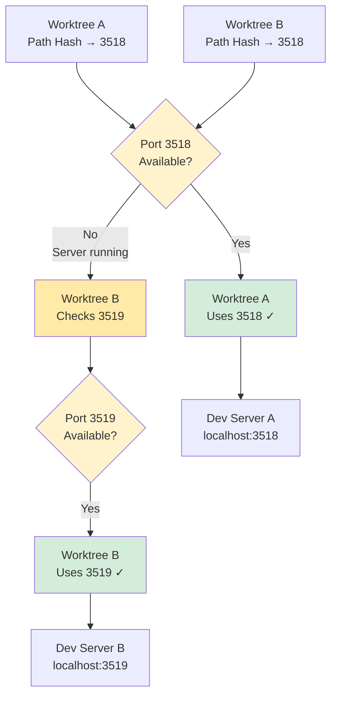
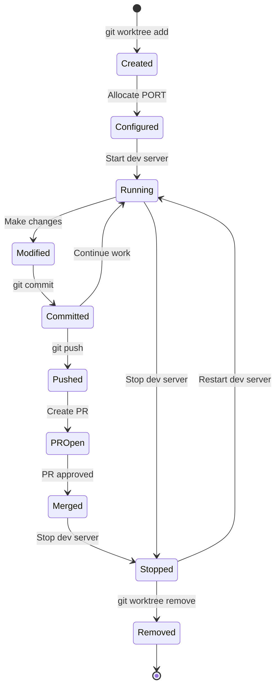
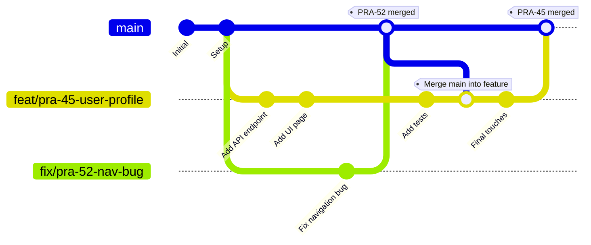
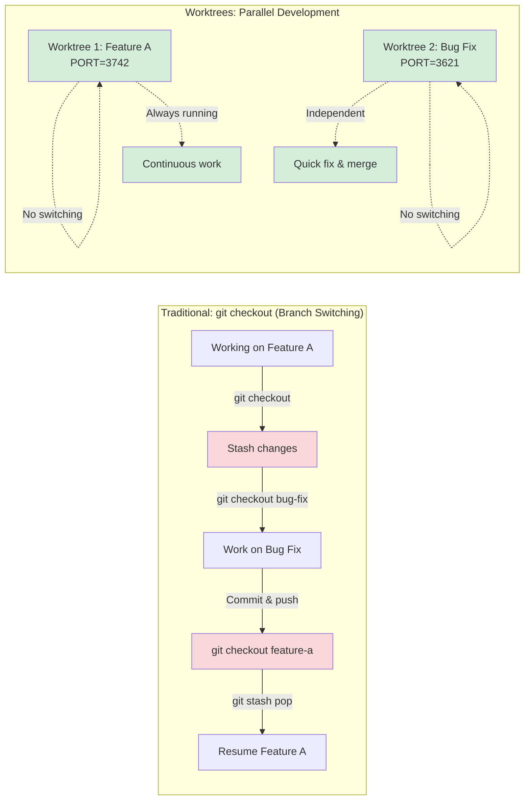

# Git Worktrees - Visual Diagrams

Visual representations of how git worktrees enable parallel development.

## 1. Directory Structure



**Key Points**:

- All worktrees share the same `.git/` directory
- Each worktree has its own working directory
- Each worktree has independent `.env.local` with unique PORT

---

## 2. Parallel Development Timeline

```mermaid
gantt
    title Parallel Development: Two Features Simultaneously
    dateFormat HH:mm
    axisFormat %H:%M

    section Main Repo
    Stay on main branch           :main, 09:00, 60m

    section Worktree 1 (PRA-45 Feature)
    Create worktree               :wt1-create, 09:00, 5m
    Allocate port (3742)          :wt1-port, after wt1-create, 2m
    Start dev server              :wt1-dev, after wt1-port, 2m
    Development work              :active, wt1-work, after wt1-dev, 120m
    Commit & push                 :wt1-commit, after wt1-work, 5m
    Create PR                     :wt1-pr, after wt1-commit, 3m

    section Worktree 2 (PRA-52 Bug Fix)
    Create worktree               :wt2-create, 09:15, 5m
    Allocate port (3621)          :wt2-port, after wt2-create, 2m
    Start dev server              :wt2-dev, after wt2-port, 2m
    Fix bug                       :crit, wt2-fix, after wt2-dev, 30m
    Test & commit                 :wt2-commit, after wt2-fix, 5m
    Create PR                     :wt2-pr, after wt2-commit, 3m
    PR merged                     :milestone, wt2-merged, after wt2-pr, 0m
    Cleanup worktree              :wt2-cleanup, after wt2-merged, 2m
```



**Timeline Breakdown**:

- **09:00-09:07**: Setup Worktree 1 (PRA-45)
- **09:15-09:22**: Setup Worktree 2 (PRA-52) *while PRA-45 dev server is running*
- **09:22-09:57**: Both dev servers running simultaneously
- **09:57**: PRA-52 merged and cleaned up
- **09:09-11:15**: PRA-45 work continues uninterrupted

---

## 3. Port Allocation Flow



**Algorithm**:

1. Hash worktree path → deterministic number
2. Map to port range (3501-3999)
3. Check availability with `lsof`
4. If taken, linear probe to next port
5. Write PORT to `.env.local`

---

## 4. Git Relationship Diagram



**Key Relationships**:

- **Shared**: Git history, branches, remotes, config
- **Independent**: Working files, checked-out branch, `.env.local`

---

## 5. Complete Workflow Sequence



---

## 6. Port Collision Scenario



**Collision Handling**:

- Same hash → same initial port attempt
- Real-time check with `lsof` detects occupied port
- Automatic linear probe to next available port
- Both worktrees get unique ports

---

## 7. Worktree Lifecycle State Machine



**States**:

- **Created**: Worktree directory exists, branch checked out
- **Configured**: PORT allocated, `.env.local` configured
- **Running**: Dev server active, development in progress
- **Modified**: Local changes, not yet committed
- **Committed**: Changes committed locally
- **Pushed**: Commits pushed to remote
- **PROpen**: Pull request created
- **Merged**: PR merged to main
- **Stopped**: Dev server stopped, worktree still exists
- **Removed**: Worktree deleted, cleanup complete

---

## 8. Parallel Testing Scenario

```mermaid
graph TD
    subgraph "Worktree 1: PRA-45"
        WT1[Run pnpm test:integration]
        WT1 --> TC1[Testcontainers]
        TC1 --> DB1[PostgreSQL<br/>Port: 54321<br/>auto-allocated]
    end

    subgraph "Worktree 2: PRA-52"
        WT2[Run pnpm test:integration]
        WT2 --> TC2[Testcontainers]
        TC2 --> DB2[PostgreSQL<br/>Port: 54322<br/>auto-allocated]
    end

    subgraph "Worktree 3: PRA-60"
        WT3[Run pnpm test:integration]
        WT3 --> TC3[Testcontainers]
        TC3 --> DB3[PostgreSQL<br/>Port: 54323<br/>auto-allocated]
    end

    DB1 -.->|isolated| DB1
    DB2 -.->|isolated| DB2
    DB3 -.->|isolated| DB3

    style DB1 fill:#d4edda
    style DB2 fill:#fff3cd
    style DB3 fill:#e3d4ff
```



**Parallel Testing**:

- Each worktree runs integration tests independently
- Testcontainers allocates unique PostgreSQL ports automatically
- No manual DATABASE_URL configuration needed
- Tests run simultaneously without conflicts

---

## 9. Branch Structure Visualization



**Branch Flow**:

1. Create `feat/pra-45-user-profile` from main
2. Create `fix/pra-52-nav-bug` from main
3. Merge PRA-52 to main (quick bug fix)
4. Merge main back into PRA-45 (stay up-to-date)
5. Complete PRA-45, merge to main

---

## 10. Developer Experience Comparison



**Traditional Flow Problems**:

- ❌ Stash/unstash changes
- ❌ Restart dev server each switch
- ❌ Context switching overhead
- ❌ Risk of stash conflicts

**Worktree Flow Benefits**:

- ✅ No stashing needed
- ✅ Dev servers stay running
- ✅ Zero context switching
- ✅ True parallel work

---

## Usage in Documentation

These diagrams can be embedded in:

1. **SKILL.md** - Core concepts section
2. **examples.md** - Visual workflow examples
3. **README.md** - Quick visual reference

### Embedding Example

````markdown
## How Worktrees Work

Worktrees allow you to check out multiple branches simultaneously:

```mermaid
[diagram here]
```

This enables true parallel development without context switching.
````

---

## Diagram Descriptions for Accessibility

1. **Directory Structure**: Shows how .worktrees/ relates to main repo
2. **Timeline**: Gantt chart of parallel development
3. **Port Allocation**: Flowchart of deterministic port assignment
4. **Git Relationship**: How worktrees share .git database
5. **Sequence**: Complete workflow from creation to cleanup
6. **Collision**: How hash collisions are resolved
7. **Lifecycle**: State machine of worktree stages
8. **Testing**: Parallel integration tests with Testcontainers
9. **Branches**: Git branch structure over time
10. **Comparison**: Traditional vs worktree workflows
