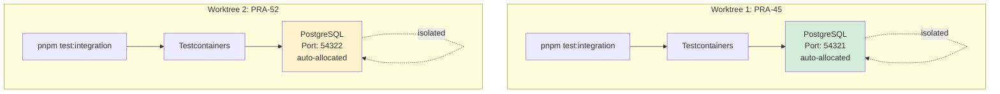

# Git Worktrees Examples

Real-world scenarios demonstrating git worktree usage patterns for parallel development.

## Parallel Development Timeline

```mermaid
gantt
    title Parallel Development: Two Features Simultaneously
    dateFormat HH:mm
    axisFormat %H:%M

    section Main Repo
    Stay on main branch           :main, 09:00, 60m

    section Worktree 1 (PRA-45 Feature)
    Create worktree               :wt1-create, 09:00, 5m
    Allocate port (3742)          :wt1-port, after wt1-create, 2m
    Start dev server              :wt1-dev, after wt1-port, 2m
    Development work              :active, wt1-work, after wt1-dev, 120m
    Commit & push                 :wt1-commit, after wt1-work, 5m
    Create PR                     :wt1-pr, after wt1-commit, 3m

    section Worktree 2 (PRA-52 Bug Fix)
    Create worktree               :wt2-create, 09:15, 5m
    Allocate port (3621)          :wt2-port, after wt2-create, 2m
    Start dev server              :wt2-dev, after wt2-port, 2m
    Fix bug                       :crit, wt2-fix, after wt2-dev, 30m
    Test & commit                 :wt2-commit, after wt2-fix, 5m
    Create PR                     :wt2-pr, after wt2-commit, 3m
    PR merged                     :milestone, wt2-merged, after wt2-pr, 0m
    Cleanup worktree              :wt2-cleanup, after wt2-merged, 2m
```



**Key Insight**: Worktree 1 runs continuously while Worktree 2 is created, used, and cleaned up - true parallel development!

---

## Example 1: Basic Worktree Creation

**Scenario**: Create a worktree for a new authentication feature (Linear issue PRA-35).

```bash
# Start from main branch
git checkout main
git pull origin main

# Verify .worktrees/ is git-ignored
git check-ignore -q .worktrees
if [ $? -ne 0 ]; then
  echo ".worktrees/" >> .gitignore
  git add .gitignore
  git commit -m "chore: add .worktrees/ to .gitignore"
fi

# Create worktree with new branch
git worktree add .worktrees/feat-pra-35-user-auth -b feat/pra-35-user-auth

# Navigate to worktree
cd .worktrees/feat-pra-35-user-auth

# Configure environment with auto-allocated port
cp ../../apps/web/.env.local apps/web/.env.local

# Auto-allocate unique port (deterministic + collision-safe)
WORKTREE_PORT=$(../../tooling/scripts/src/worktree-port.sh .)
echo "PORT=$WORKTREE_PORT" >> apps/web/.env.local
echo "Allocated port: $WORKTREE_PORT"

# Run baseline tests
pnpm test
pnpm --filter web run type-check

# Start development
pnpm dev
# → http://localhost:3500
```

**Expected Output**:

```text
Preparing worktree (new branch 'feat/pra-35-user-auth')
HEAD is now at 61ce6f2 feat: implement rate limiting infrastructure

Allocated port: 3518
✓ Allocated port 3518 (deterministic match)

✓ All tests passed
✓ Type checking complete: 0 errors

> dev
> next dev

 ▲ Next.js 15.x.x
 - Local:        http://localhost:3518
```

---

## Example 2: Parallel Development with Multiple Worktrees

**Scenario**: Work on two features simultaneously - authentication (PRA-35) and payment integration (PRA-42) with automatic port allocation.

```bash
# Create first worktree (authentication)
git worktree add .worktrees/feat-pra-35-user-auth -b feat/pra-35-user-auth
cd .worktrees/feat-pra-35-user-auth

# Configure with auto-allocated port
cp ../../apps/web/.env.local apps/web/.env.local
WORKTREE_PORT=$(../../tooling/scripts/src/worktree-port.sh .)
echo "PORT=$WORKTREE_PORT" >> apps/web/.env.local
echo "Worktree 1 allocated port: $WORKTREE_PORT"

# Start dev server in background (Terminal 1)
pnpm dev
# → http://localhost:[allocated-port]

# Go back to parent
cd ../..

# Create second worktree (payments)
git worktree add .worktrees/feat-pra-42-stripe-payments -b feat/pra-42-stripe-payments
cd .worktrees/feat-pra-42-stripe-payments

# Configure with auto-allocated port (different from first worktree)
cp ../../apps/web/.env.local apps/web/.env.local
WORKTREE_PORT=$(../../tooling/scripts/src/worktree-port.sh .)
echo "PORT=$WORKTREE_PORT" >> apps/web/.env.local
echo "Worktree 2 allocated port: $WORKTREE_PORT"

# Start dev server in different terminal (Terminal 2)
pnpm dev
# → http://localhost:[allocated-port]

# List all worktrees
cd ../..
git worktree list
```

**Expected Output**:

```text
Worktree 1 allocated port: 3518
✓ Allocated port 3518 (deterministic match)

Worktree 2 allocated port: 3502
✓ Allocated port 3502 (deterministic match)

/Users/you/code/software-multi-tool              61ce6f2 [main]
/Users/you/code/software-multi-tool/.worktrees/feat-pra-35-user-auth    61ce6f2 [feat/pra-35-user-auth]
/Users/you/code/software-multi-tool/.worktrees/feat-pra-42-stripe-payments  61ce6f2 [feat/pra-42-stripe-payments]
```

**Result**: Two dev servers running simultaneously on automatically allocated ports (e.g., 3518 and 3502). No port conflicts, no manual assignment needed!

---

## Example 3: Parallel Integration Tests

**Scenario**: Run database integration tests for two different features in parallel (Testcontainers handles database isolation automatically).



```bash
# Terminal 1 - Test authentication feature
cd .worktrees/feat-pra-35-user-auth
pnpm --filter @repo/database run test:integration

# Terminal 2 - Test payment feature (runs in parallel!)
cd .worktrees/feat-pra-42-stripe-payments
pnpm --filter @repo/database run test:integration
```

**What Happens**:

1. **Worktree 1**: Testcontainers creates PostgreSQL container on random port (e.g., 54321)
2. **Worktree 2**: Testcontainers creates separate PostgreSQL container on different random port (e.g., 54322)
3. **No conflicts**: Each test suite uses its own isolated database
4. **Auto-cleanup**: Containers are removed after tests complete

**Expected Output (Worktree 1)**:

```text
Starting PostgreSQL container...
Database ready on port 54321
Running 15 tests...
✓ All tests passed (12.4s)
Stopping container...
```

**Expected Output (Worktree 2)**:

```text
Starting PostgreSQL container...
Database ready on port 54322
Running 22 tests...
✓ All tests passed (15.1s)
Stopping container...
```

**No manual DATABASE_URL configuration needed!**

---

## Example 4: Hotfix Workflow

**Scenario**: You're working on a feature (PRA-35) when a critical bug (PRA-99) needs immediate fixing. Use a worktree to create the hotfix without disrupting your feature work.

```bash
# Currently working on feature
pwd
# /Users/you/code/software-multi-tool/.worktrees/feat-pra-35-user-auth

# Uncommitted changes in feature branch - no problem!
git status
# Modified: apps/web/app/auth/page.tsx
# Not staged for commit

# Go to parent repository
cd ../..

# Create hotfix worktree from clean main
git fetch origin main
git worktree add .worktrees/fix-pra-99-login-bug -b fix/pra-99-login-bug main

# Navigate to hotfix worktree
cd .worktrees/fix-pra-99-login-bug

# Configure environment with auto-allocated port
cp ../../apps/web/.env.local apps/web/.env.local
WORKTREE_PORT=$(../../tooling/scripts/src/worktree-port.sh .)
echo "PORT=$WORKTREE_PORT" >> apps/web/.env.local
echo "Hotfix worktree allocated port: $WORKTREE_PORT"

# Fix the bug
vim packages/auth/auth.ts
# (make fix)

# Test the fix
pnpm test
pnpm --filter web run type-check

# Commit and push
git add packages/auth/auth.ts
git commit -m "fix(auth): resolve login redirect loop

Fixes issue where users were stuck in redirect loop after
successful authentication due to incorrect session check.

Closes PRA-99

🤖 Generated with [Claude Code](https://claude.com/claude-code)

Co-Authored-By: Claude Sonnet 4.5 <noreply@anthropic.com>"

git push -u origin fix/pra-99-login-bug

# Create PR
gh pr create --base main --title "fix(auth): resolve login redirect loop" \
  --body "Fixes PRA-99 - Login redirect loop"

# Return to feature work (unchanged!)
cd ../.worktrees/feat-pra-35-user-auth
git status
# Modified: apps/web/app/auth/page.tsx (still there!)

# Continue feature development
pnpm dev
```

**Result**: Hotfix is completed and shipped without disrupting feature work. Feature worktree remains exactly as you left it.

---

## Example 5: Code Review Workflow

**Scenario**: Review a teammate's PR (PR #42) locally before approving, without losing your current work.

```bash
# Currently working on feature
pwd
# /Users/you/code/software-multi-tool/.worktrees/feat-pra-35-user-auth

# Go to parent
cd ../..

# Fetch the PR branch
gh pr checkout 42 --detach

# Create worktree for PR review
git worktree add .worktrees/review-pr-42 FETCH_HEAD

cd .worktrees/review-pr-42

# Configure with auto-allocated port for review
cp ../../apps/web/.env.local apps/web/.env.local
WORKTREE_PORT=$(../../tooling/scripts/src/worktree-port.sh .)
echo "PORT=$WORKTREE_PORT" >> apps/web/.env.local
echo "Review worktree allocated port: $WORKTREE_PORT"

# Install dependencies (if PR updated pnpm-lock.yaml)
pnpm install

# Run tests
pnpm test
pnpm --filter web run type-check

# Test the feature manually
pnpm dev
# → http://localhost:3504

# Open in browser and test the feature
# (review completed)

# Leave feedback on PR
gh pr review 42 --approve --body "LGTM! Tested locally ✓"

# Clean up review worktree
cd ../..
git worktree remove .worktrees/review-pr-42

# Return to your feature work
cd .worktrees/feat-pra-35-user-auth
```

**Result**: PR reviewed and tested locally without affecting your feature branch. Your work remains untouched.

---

## Example 6: Long-Running Feature Branch with Periodic Main Merges

**Scenario**: Feature branch (PRA-35) has been in development for 2 weeks. Main branch has advanced significantly. Merge main into feature branch periodically to stay up-to-date.

```bash
cd .worktrees/feat-pra-35-user-auth

# Check how far behind main
git fetch origin main
git log --oneline HEAD..origin/main
# Shows 15 commits since branch creation

# Merge main into feature branch
git merge origin/main

# Resolve conflicts (if any)
# (edit conflicting files)

git add .
git commit -m "chore: merge main into feat/pra-35-user-auth"

# Run tests to verify merge didn't break anything
pnpm test
pnpm --filter web run type-check
pnpm --filter @repo/database run test:integration

# Push updated branch
git push origin feat/pra-35-user-auth
```

**Best Practice**: Merge main into long-running feature branches every 3-5 days to:

- Minimize merge conflicts
- Catch integration issues early
- Keep feature branch testable

---

## Example 7: Handling Merge Conflicts in Worktree

**Scenario**: While merging main into your feature branch in a worktree, conflicts occur.

```bash
cd .worktrees/feat-pra-35-user-auth

# Attempt merge
git merge origin/main

# Conflict detected
# Auto-merging packages/auth/auth.ts
# CONFLICT (content): Merge conflict in packages/auth/auth.ts
# Automatic merge failed; fix conflicts and then commit the result.

# Check conflict status
git status
# Unmerged paths:
#   both modified: packages/auth/auth.ts

# Resolve conflicts manually
code packages/auth/auth.ts
# (resolve conflict markers: <<<<<<< HEAD, =======, >>>>>>>)

# Stage resolved files
git add packages/auth/auth.ts

# Continue merge
git commit

# Verify resolution
pnpm test
pnpm --filter web run type-check

# Push
git push origin feat/pra-35-user-auth
```

**Alternative - Abort Merge**:

```bash
# If conflicts are too complex, abort and try later
git merge --abort

# Check status (back to pre-merge state)
git status
```

---

## Example 8: Cleanup Workflow After PR Merge

**Scenario**: Feature (PRA-35) is completed, PR is merged, and you need to clean up the worktree.

```bash
# Verify PR is merged
gh pr view feat/pra-35-user-auth
# State: MERGED
# Merged by: @teammate
# Merged at: 2026-01-06 10:30 AM

# Close Linear issue
pnpm --filter @repo/scripts linear issues close --issue PRA-35

# Stop dev server (if running)
# Ctrl+C in terminal running pnpm dev

# Go to parent repository
cd /Users/you/code/software-multi-tool

# Remove worktree
git worktree remove .worktrees/feat-pra-35-user-auth

# Delete local branch
git branch -d feat/pra-35-user-auth
# Branch deleted (was 3a4b5c6)

# Delete remote branch (if not auto-deleted)
git push origin --delete feat/pra-35-user-auth

# Prune stale references
git worktree prune

# Verify cleanup
git worktree list
# /Users/you/code/software-multi-tool  61ce6f2 [main]

# Update main branch
git checkout main
git pull origin main
```

**Result**: Worktree cleaned up, branch deleted, Linear issue closed. Repository is ready for next feature.

---

## Common Patterns Summary

| Pattern | Command | Use Case |
| ------- | ------- | -------- |
| Create worktree from main | `git worktree add .worktrees/<name> -b <branch>` | New feature/fix |
| Create worktree from PR | `gh pr checkout <num> --detach && git worktree add .worktrees/review-pr-<num> FETCH_HEAD` | PR review |
| Auto-allocate port | `WORKTREE_PORT=$(../../tooling/scripts/src/worktree-port.sh .)` | Collision-free dev servers |
| Configure port in .env | `echo "PORT=$WORKTREE_PORT" >> apps/web/.env.local` | Set allocated port |
| Check port availability | `tooling/scripts/src/worktree-port.sh <path> --check-only` | Verify port is free |
| Run parallel tests | Run `pnpm test:integration` in multiple terminals | Testcontainers isolation |
| Merge main into feature | `git merge origin/main` | Keep feature up-to-date |
| Remove worktree | `git worktree remove .worktrees/<name>` | Cleanup after merge |
| Prune stale worktrees | `git worktree prune` | Clean up references |

## Tips for Success

1. **Use automatic port allocation** - `tooling/scripts/src/worktree-port.sh` prevents conflicts
2. **Let Testcontainers handle database isolation** - no manual DATABASE_URL needed
3. **Use descriptive worktree directory names** matching branch names
4. **Clean up worktrees promptly** after PR merge to save disk space
5. **Leverage parallel testing** - Testcontainers makes it safe and easy
6. **Follow Linear workflow** - include PRA-XX in branch names, close issues
7. **Merge main frequently** into long-running feature branches
8. **Review PRs in worktrees** instead of switching branches
9. **Use hotfix worktrees** for urgent fixes without disrupting feature work
10. **Monitor disk usage** - each worktree uses ~500MB+
11. **Trust deterministic port allocation** - same worktree → same port attempt
