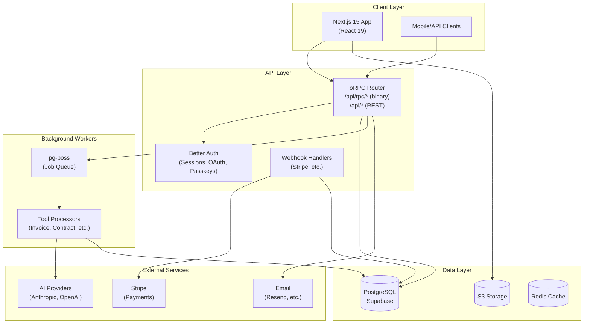
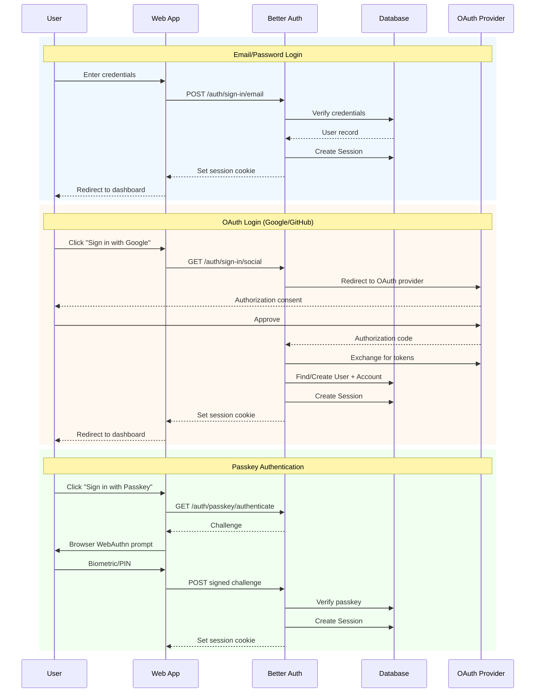
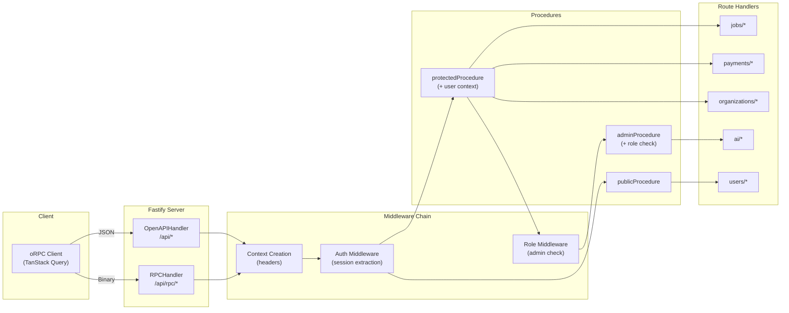
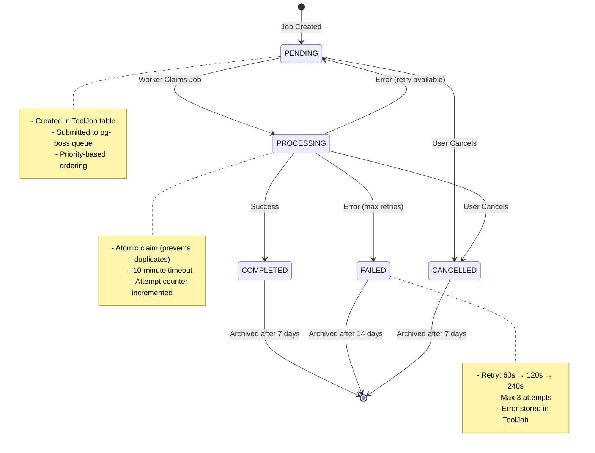
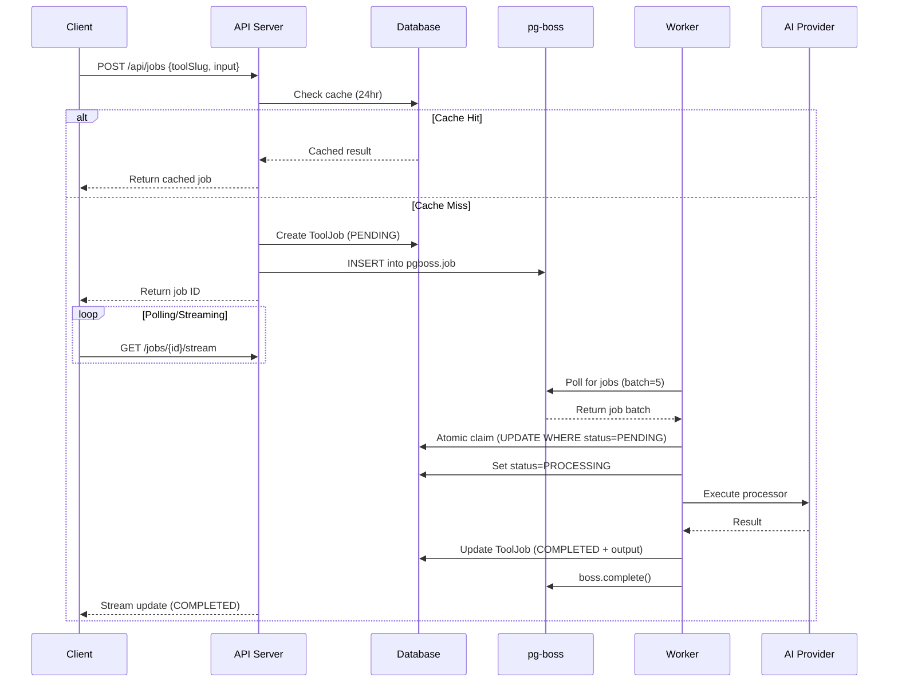
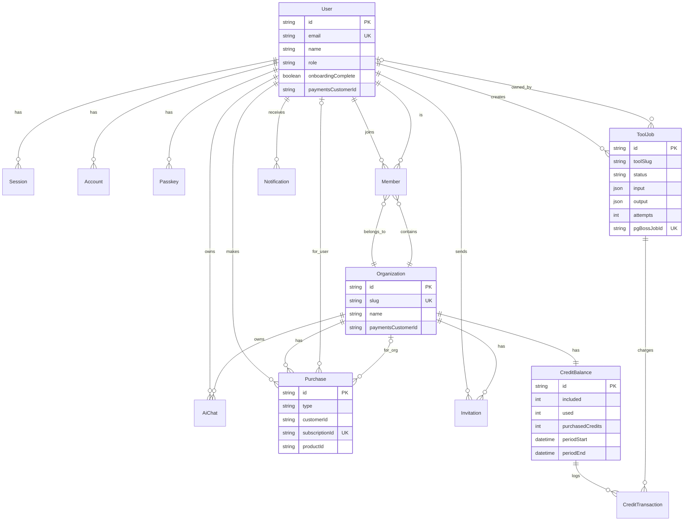
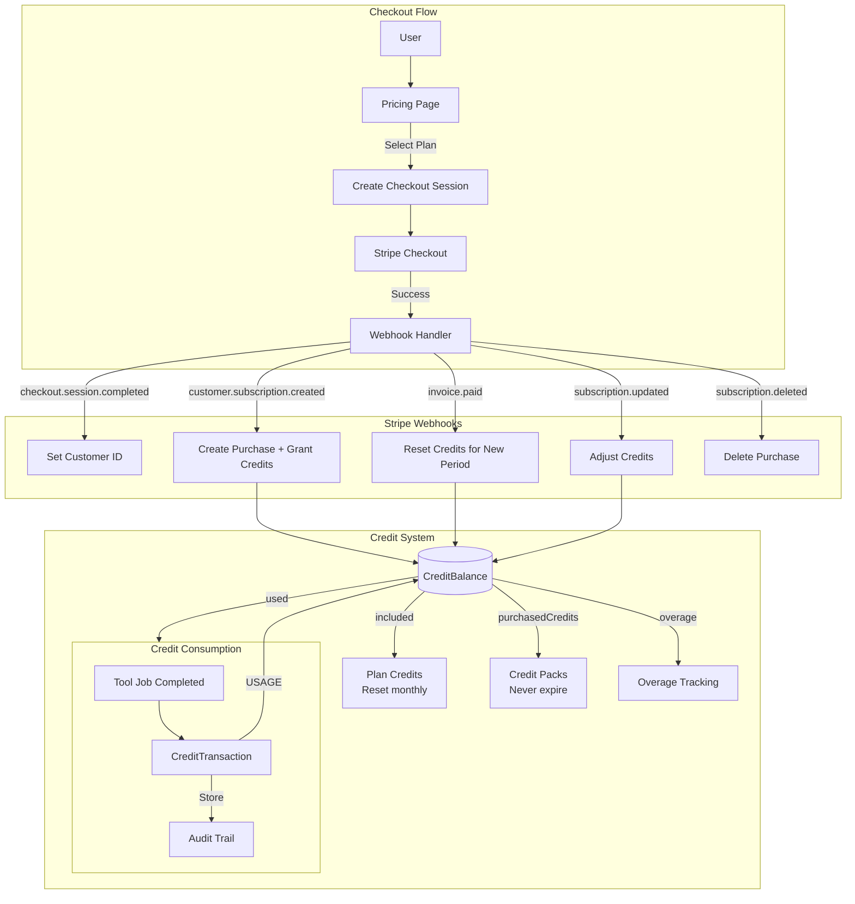
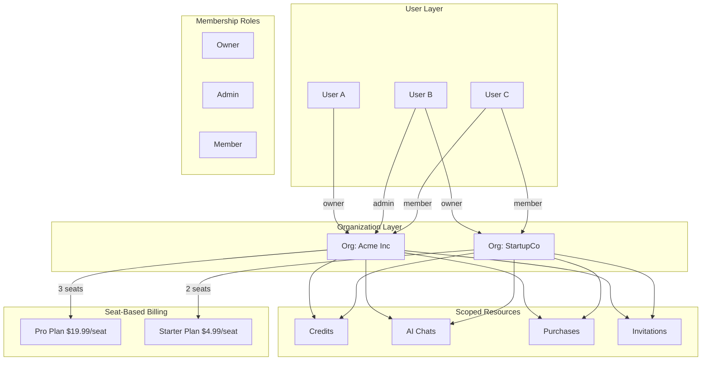
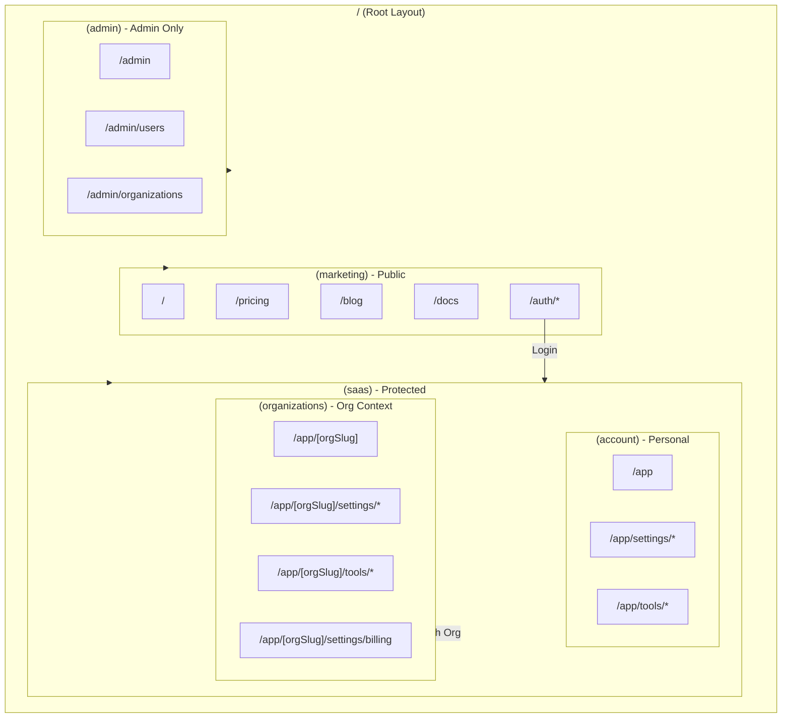
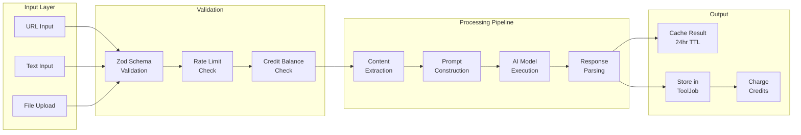

# Architecture Diagrams

## 1. System Architecture Overview



## 2. Authentication Flow



## 3. API Request Flow (oRPC)



## 4. Background Job Processing Pipeline



## 5. Job Processing Detail Flow



## 6. Data Model - Entity Relationships



## 7. Payment & Credit Flow



## 8. Multi-tenant Organization Structure



## 9. Frontend Application Structure



## 10. AI Tool Processing Architecture



## 11. Deployment Architecture

```mermaid
flowchart TB
    subgraph GitHub["GitHub"]
        Repo[Repository]
        Actions[GitHub Actions<br/>CI/CD]
    end

    subgraph Vercel["Vercel"]
        Preview[Preview<br/>Deployments]
        Prod[Production<br/>Deployment]
        Edge[Edge<br/>Functions]
    end

    subgraph Render["Render"]
        API[API Server<br/>(Fastify + pg-boss)]
        Worker[Background<br/>Workers]
    end

    subgraph Supabase["Supabase"]
        DB[(PostgreSQL)]
        Branch[Preview<br/>Branches]
        Auth2[Auth<br/>Extensions]
    end

    subgraph AWS["AWS"]
        S3[(S3 Bucket<br/>File Storage)]
    end

    subgraph Services["External Services"]
        Stripe2[Stripe]
        Anthropic[Anthropic]
        OpenAI2[OpenAI]
        Resend[Resend/Email]
    end

    Repo --> Actions
    Actions --> Preview
    Actions --> Prod
    Actions --> API

    Prod --> Edge
    Edge --> API
    API --> DB
    API --> S3

    Preview --> Branch

    Worker --> DB
    Worker --> Anthropic
    Worker --> OpenAI2

    API --> Stripe2
    API --> Resend
```

## Usage

To render these diagrams:
1. **GitHub/GitLab**: Markdown preview renders Mermaid automatically
2. **VS Code**: Install "Markdown Preview Mermaid Support" extension
3. **Online**: Paste into [mermaid.live](https://mermaid.live)
4. **Docs**: Fumadocs supports Mermaid via MDX plugins
