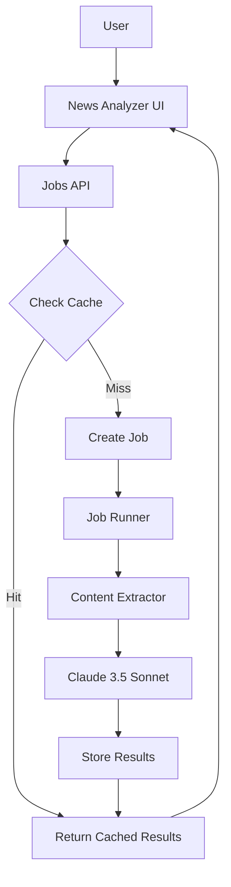
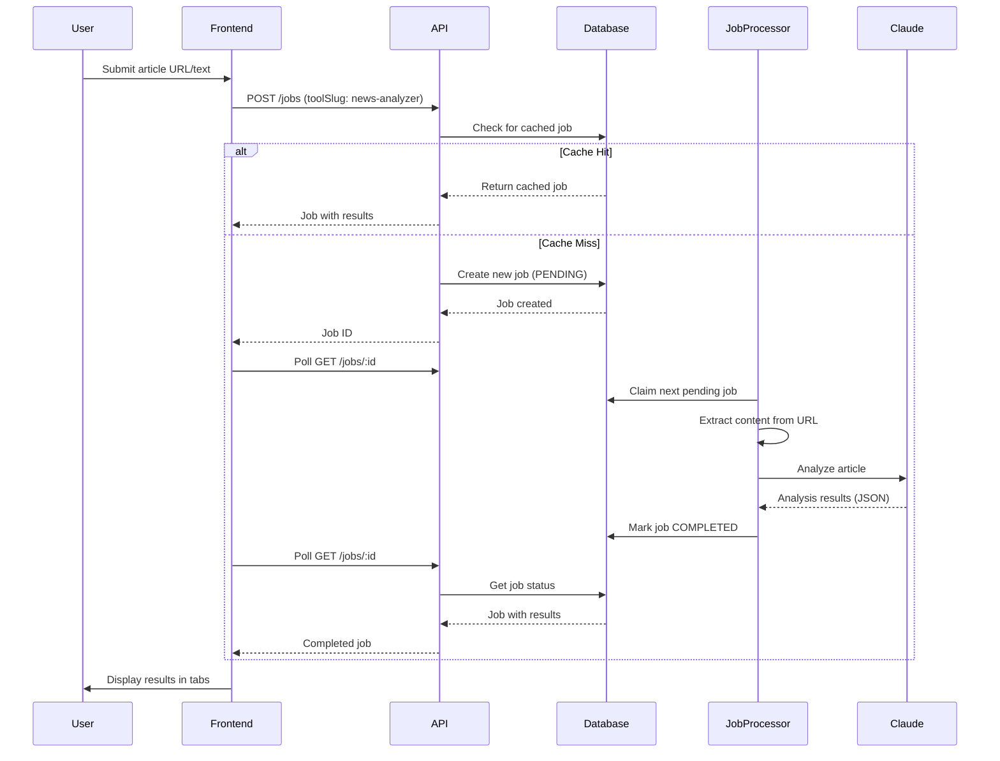
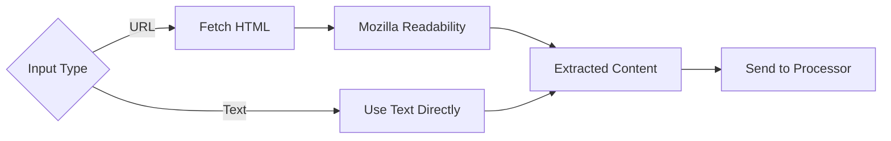
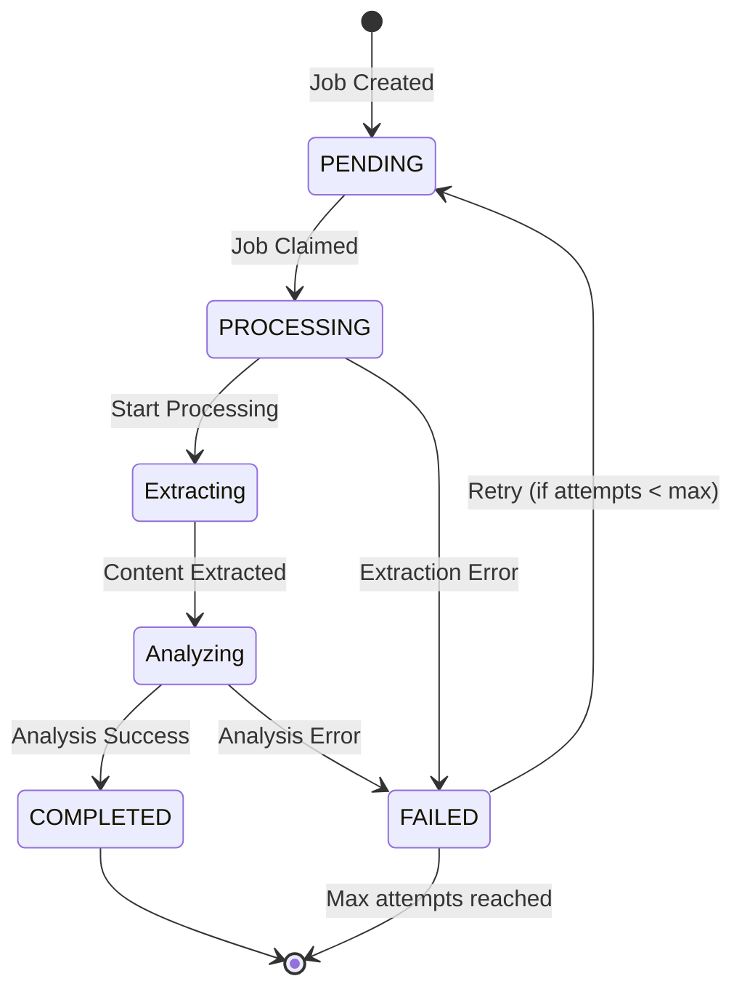
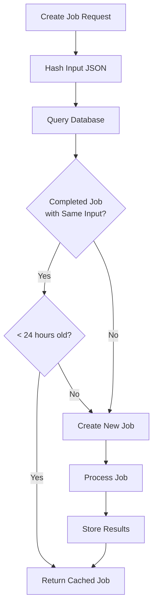

# News Analyzer Module

The News Analyzer is an AI-powered tool that analyzes news articles for bias, sentiment, entities, and key information using Claude 3.5 Sonnet.

## Architecture Overview



## Request Flow



## Component Structure

### Backend Components

```text
packages/api/modules/news-analyzer/
├── lib/
│   ├── content-extractor.ts    # URL fetching & content extraction
│   ├── processor.ts            # Job processing & Claude integration
│   └── register.ts             # Processor registration
├── index.ts                    # Module exports
└── README.md                   # This file
```

### Frontend Components

```text
apps/web/components/tools/news-analyzer/
├── news-analyzer.tsx           # Main component with polling logic
├── news-analyzer-form.tsx      # Input form (URL/text modes)
├── news-analyzer-results.tsx   # Tabbed results display
└── index.ts                    # Component exports
```

## Data Flow

### 1. Content Extraction



### 2. Job Processing



### 3. Claude Analysis

The processor sends a comprehensive prompt to Claude that requests structured JSON output:

```typescript
{
  summary: string[];              // 3-5 key points
  bias: {
    politicalLean: string;        // Left/Center-Left/Center/Center-Right/Right
    sensationalism: number;       // 0-10 scale
    factualRating: string;        // High/Medium/Low
  };
  entities: {
    people: string[];
    organizations: string[];
    places: string[];
  };
  sentiment: string;              // Positive/Neutral/Negative
  sourceCredibility?: string;     // High/Medium/Low/Unknown
}
```

## Caching Strategy



**Cache Key**: `toolSlug` + `input` JSON (exact match)
**Cache Duration**: 24 hours
**Benefits**: Reduces Claude API costs for duplicate analyses

## Error Handling

### Content Extraction Errors

- **INVALID_URL**: Malformed URL
- **FETCH_FAILED**: Network error, timeout, or HTTP error
- **PAYWALL**: 403/451 status codes
- **PARSE_FAILED**: HTML parsing error
- **NO_CONTENT**: Readability couldn't extract article

### Job Processing Errors

- Timeout after 5 minutes (configurable)
- Retries with exponential backoff: 1min, 4min, 16min
- Max 3 attempts before marking as FAILED

## Rate Limiting

Configured in `config/index.ts`:

- **Anonymous users**: 10 requests per day
- **Authenticated users**: 100 requests per hour

## Integration Points

### Database

- Uses existing `ToolJob` model from `@repo/database`
- New `findCachedJob()` function for cache lookup
- Job ownership via `userId` or `sessionId`

### API

- Uses existing `/api/jobs` endpoints
- No custom routes needed
- Registered in `packages/api/index.ts`

### Agent SDK

- `executePrompt()` from `@repo/agent-sdk`
- Model: `claude-3-5-sonnet-20241022`
- Max tokens: 2048
- Temperature: 0.3 (for consistent structured output)

## Testing Considerations

1. **Content Extraction**
   - Test various news sources
   - Handle paywalled content gracefully
   - Validate extracted content structure

2. **Claude Analysis**
   - JSON parsing with fallback error handling
   - Validate output structure
   - Handle malformed Claude responses

3. **Caching**
   - Verify cache hits for identical URLs
   - Confirm 24-hour expiration
   - Test cache miss scenarios

4. **Job Processing**
   - Timeout handling
   - Retry logic
   - Error propagation

## Performance

- **Cache Hit**: < 100ms (database query only)
- **Cache Miss**: 10-30 seconds (content fetch + Claude analysis)
- **Caching Impact**: ~90% cost reduction for repeat analyses

## Future Enhancements

- Source credibility database integration
- Multi-source article comparison
- Historical bias tracking for sources
- Fact-checking integration
- Export to PDF/markdown
